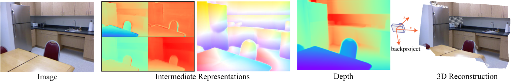
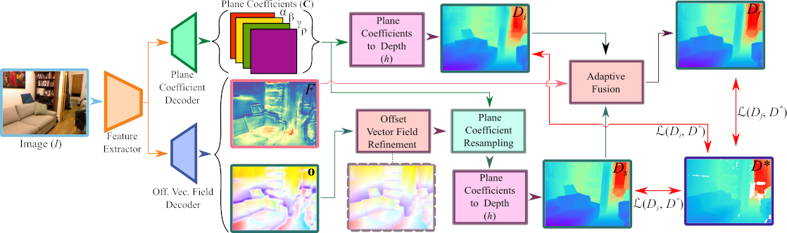

# P3Depth: Monocular Depth Estimation with a Piecewise Planarity Prior
[Vaishakh Patil](https://www.trace.ethz.ch/team/members/vaishakh.html), [Dr. Christos Sakaridis](https://people.ee.ethz.ch/~csakarid/), [Dr. Alex Liniger](https://www.trace.ethz.ch/team/members/alex.html) and [Prof. Luc Van Gool](https://www.trace.ethz.ch/team/members/luc.html)

[CVPR 2022](https://openaccess.thecvf.com/content/CVPR2022/html/Patil_P3Depth_Monocular_Depth_Estimation_With_a_Piecewise_Planarity_Prior_CVPR_2022_paper.html) [(pdf)](https://openaccess.thecvf.com/content/CVPR2022/papers/Patil_P3Depth_Monocular_Depth_Estimation_With_a_Piecewise_Planarity_Prior_CVPR_2022_paper.pdf) | 
[arXiv](https://arxiv.org/abs/2204.02091) [(pdf)](https://arxiv.org/pdf/2204.02091.pdf) |
[Project page](https://www.trace.ethz.ch/publications/2022/p3depth/index.html)

***This repository is still being updated !!!***

This is the reference PyTorch implementation for training and evaluation of depth estimation models using the method described in our paper.

<p align="center">
  
</p>

## License

This software is released under a creative commons [license](LICENSE.txt) which allows for personal and research use only. For a commercial license please contact the authors. You can view a license summary [here](http://creativecommons.org/licenses/by-nc/4.0/).

## P3Depth: Monocular Depth Estimation with a Piecewise Planarity Prior
<p align="center">
  
</p>

Our end-to-end P3Depth method uses the offset vector field to define interactions between pixels within a plane coefficient representation. The plane coefficients of seed pixels are used to predict depth at each position. The resulting prediction is adaptively fused with the initial prediction based on the confidence map to account for potential deviations from precise local planarity.

## Contents
1. [Installation](#Installation)
2. [Training](#Training)
3. [Evaluation](#Evaluation)
4. [Citation](#citation)
5. [Contributions](#Contributions)
6. [Acknowledgement](#Acknowledgement)

## Installation

For setup, you need:

1. Linux
2. NVIDIA GPU with CUDA & CuDNN
3. Python 3
4. Conda 

Use the package manager [pip](https://pip.pypa.io/en/stable/) to install foobar.

```bash
conda create -n p3depth python=3.7
conda activate p3depth
conda install pytorch==1.7.0 torchvision==0.8.0 torchaudio==0.7.0 cudatoolkit=9.2 -c pytorch
pip install -r requirements.txt
```

## Dataset

For data preparation of NYU Depth v2 and KITTI datasets, we follow "Lee et al., From Big to Small: Multi-Scale Local Planar Guidance
for Monocular Depth Estimation, arXiv 2019". 
Refer to [From Big to Small](https://github.com/cleinc/bts) git repository for more information.
- We follow [From Big to Small](https://github.com/cleinc/bts) for train/test split for both NYU Depth v2 and KITTI datasets.
- The train/test list files should be named train.txt and test.txt respectively.
- The dataset path in .yaml files located in config/dataset directory should point to a directory containing train.txt and test.txt.

## Training

- Before staring training, check config files for correct parameters. The path to output directory is located in config/default.yaml. The default parameters for model are located in config/model directory and for dataset are in config/dataset directory.
  - For training, use experiments/train.sh file. Set correct MODEL_CONFIG, DATASET_CONFIG, and EXP_CONFIG files. You may have to change this file as per your systems training protocol along with L113 trainer.py and "check_machine" method in src/utils.py
- The experiments can be launched with.
```bash
cd experiments
./train.sh
```
- More details on the training procedure will be released soon.

## Evaluation

- For evaluation, use the experiments/train.sh by setting "--test" flag as follows:
```bash
python3 -u trainer.py --test --model_config ${MODEL_CONFIG} --dataset_config ${DATASET_CONFIG} --exp_config ${EXP_CONFIG}
```
- Use the standard test split for NYU Depth v2 and KITTI as described in Dataset section.
- The evaluation can be launched with.
```bash
cd experiments
./train.sh
```
- More details on evaluation and pretrained models will be released soon.

## Citation

If you find our work useful in your research please consider citing our publication:

```bibtex
@inproceedings{P3Depth,
  author    = {Patil, Vaishakh and Sakaridis, Christos and Liniger, Alex and Van Gool, Luc},
  title     = {P3Depth: Monocular Depth Estimation with a Piecewise Planarity Prior},
  booktitle = {Proceedings of the IEEE/CVF Conference on Computer Vision and Pattern Recognition (CVPR)},
  year      = {2022},
}
```

## Contributions

If you find any bug in the code. Please report to <br>
Vaishakh Patil (patil_at_vision.ee.ethz.ch)

## Acknowledgement

This work was supported by Toyota through project TRACE Zurich (Toyota Research on Automated Cars in Europe - Zurich).
We thank authors following repositories for sharing the code: [From Big to Small](https://github.com/cleinc/bts), [Structure-Guided Ranking Loss](https://github.com/KexianHust/Structure-Guided-Ranking-Loss), [Virtual Normal Loss](https://github.com/YvanYin/VNL_Monocular_Depth_Prediction), [Revisiting Single Image Depth Estimation](https://github.com/JunjH/Revisiting_Single_Depth_Estimation).